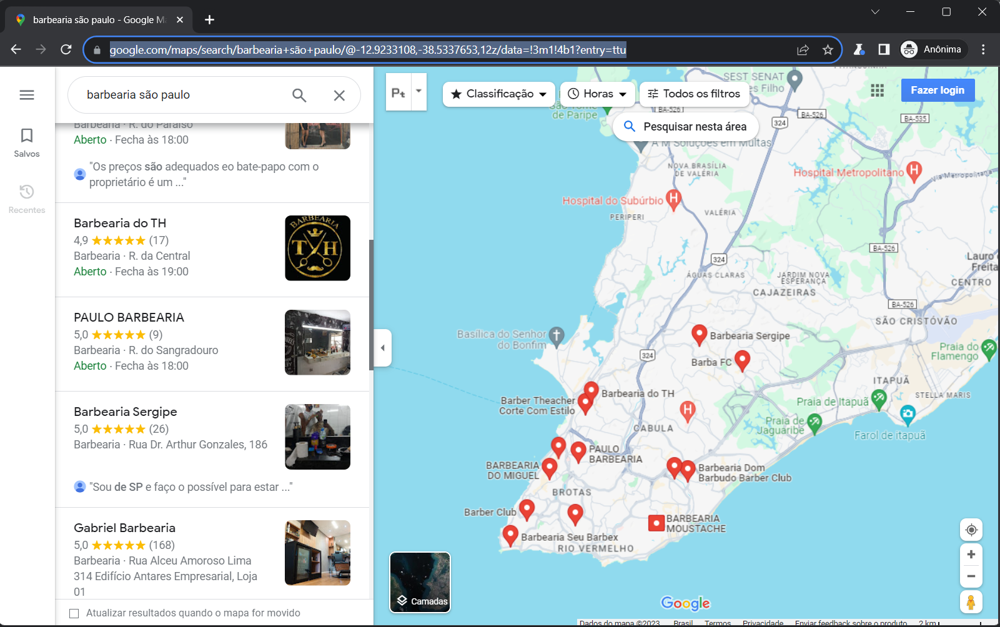

# Extractor Lead - ELS

## Description

Lead Extractor is a program specialized in identifying and qualifying leads through Google Maps. It is designed to 
collect all essential information, such as establishment name, address, contact number, website and reviews, and 
organize this data into an Excel or CSV file, making it easier to manage and use this information to improve 
business strategies.

## Demostration





## Technologies used

[](https://skillicons.dev)

## Starting

To run the project, you need to install the following programs:

- [Python: Mandatory to create the project](https://www.python.org/downloads/)
- [VS Code: Mandatory to develop the project](https://code.visualstudio.com/)

## How to use 


## Existing features

  - Search with specific leads with area and location
  - Download to csv
  - Download to excel

## Future features

  - Add contacts to WhatsApp

## ⌨️ Developing

Use Gitpod, a free online development environment for GitHub.

[](https://gitpod.io/#https://github.com/Suspir0n/extractorleads.git)

Or use the code locally using:
```
$ cd "directory of your choice"
$ git clone https://github.com/Suspir0n/extractorleads.git
```

### Building

To build a Python application, run the commands below:

First of all create a virtual environment with this command:

```
python -m venv venv
```

After activating:

for windows
```
venv/Scripts/activate
```

for linux
```
venv/bin/activate
```

Now, run this command to install the dependencies:

```
$ pip install -r requirements.txt
```

These are the dependencies within requirements.txt:

```
customtkinter==5.2.1
darkdetect==0.8.0
et-xmlfile==1.1.0
greenlet==3.0.0
numpy==1.26.2
openpyxl==3.1.2
packaging==23.2
pandas==2.1.3
playwright==1.39.0
pyee==11.0.1
python-dateutil==2.8.2
pytz==2023.3.post1
six==1.16.0
typing_extensions==4.8.0
tzdata==2023.3
```

## Configuration

To execute the project, it is necessary to use VsCode or an IDE of your preference, so that it identifies the dependencies necessary for execution in the repository. Once the project is imported, it will be possible to test its functionality in real time.

## Contributions

Contributions are always welcome! I hope I have helped someone in need.

## 🔓 License
MIT © [Evandro Silva](https://www.linkedin.com/in/suspir0n/)